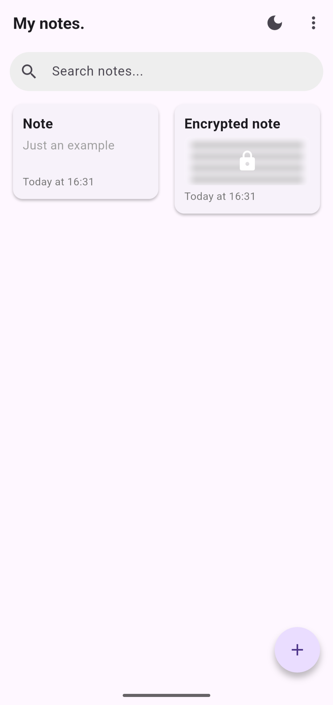
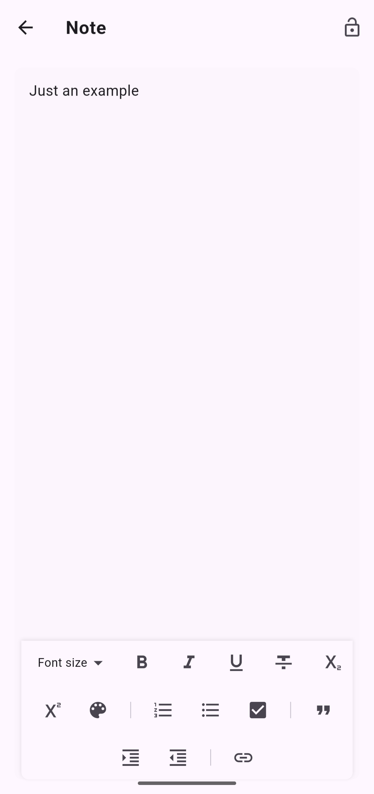
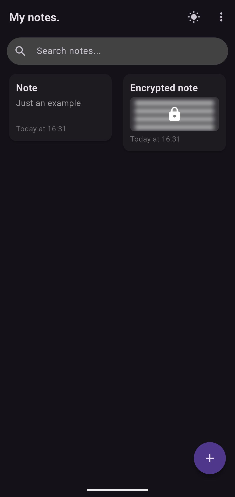
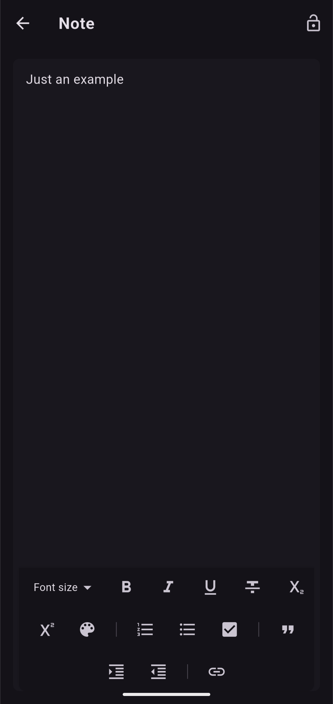

# NotySafe
NotySafe lets you create, edit and manage your notes with advanced security features.

## 🔐 Main features
- **Note creation and management**: easily create and organize your notes
- **Note encryption**: Protect your sensitive information with AES 256-bit encryption.
- **Biometric authentication**: Unlock your notes with your fingerprint or facial recognition
- **Adaptive interface**: Light and dark modes for optimum user experience
- **Quick search**: Find your notes easily with the built-in search function

## 📱 Supported platforms
- Android
- iOS

## 📲 Installation
### Android
Download the latest APK from the [Releases](https://github.com/szerookii/notysafe/releases) page and install it on your device.

### iOS
1. Install [AltStore](https://altstore.io/) or [SideStore](https://sidestore.io/) on your iOS device
2. Download the latest IPA from the [Releases](https://github.com/szerookii/notysafe/releases) page
3. Open the IPA file with AltStore/SideStore to install NotySafe

## 🛠️ Development
1. Clone this repository:
```bash
git clone https://github.com/szerookii/notysafe.git
```
2. Navigate to the project directory:
```bash
cd notysafe
```
3. Install dependencies:
```bash
flutter pub get
```
4. Run the application:
```bash
flutter run
```

## 🖥️ Screenshots
<div style="display: flex; flex-wrap: wrap; gap: 10px; justify-content: center;">

  
  
  
</div>


## 📄 License
This project is licensed. See the [LICENSE](LICENSE) file for details.

## 🤝 Contribution
Contributions are welcome! Feel free to submit a pull request or open an issue.